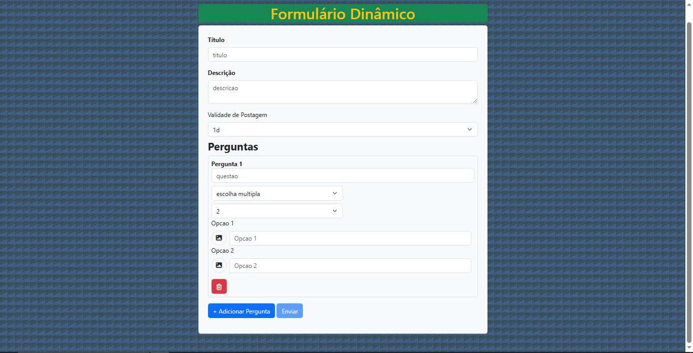

# Formulário Dinâmico

**AVISO: Este projeto é apenas para fins de estudo e avaliação de empregadores. Se você deseja utilizar este código em seus próprios projetos, por favor mencione o autor original.**

Este projecto é um formulário dinâmico que permite aos usuários criar perguntas personalizadas com opções de escolha múltipla ou resposta em texto.

## Funcionalidades

- Adicione um título e descrição ao formulário.
- Defina a validade de postagem do formulário.
- Crie perguntas personalizadas com opções de escolha múltipla ou resposta em texto.
- Adicione ou remova perguntas dinamicamente.

## Tecnologias Utilizadas

- HTML
- CSS
- JavaScript
- Bootstrap

## Pré-requisitos

Certifique-se de ter as seguintes dependências instaladas:

- Bootstrap (arquivos CSS e JS)
- Font Awesome (arquivos CSS)
- Biblioteca JavaScript personalizada (inquerito.js)

## Instruções de Uso

1. Faça o download ou clone este repositório.
2. Certifique-se de incluir os arquivos CSS e JS necessários em seu projeto.
3. Abra o arquivo HTML principal em seu navegador.
4. Preencha o título, descrição e outras informações necessárias.
5. Crie perguntas personalizadas usando as opções disponíveis.
6. Adicione ou remova perguntas conforme necessário.
7. Valide e envie o formulário.

## Imagens

Aqui estão algumas capturas de tela do formulário dinâmico em ação:

*Formulario sem perguntas*

*Formulario com 1 pergunta adicionada*

